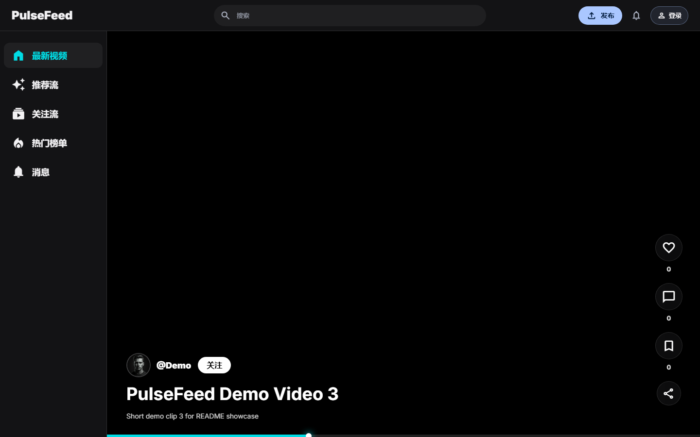
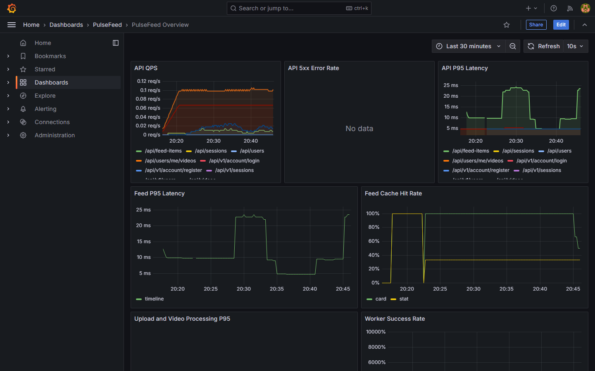

<p align="center">
  
</p>

<p align="center">
  <strong>面向短视频场景的 Feed 系统工程</strong><br/>
  基于 Go API 单体、React Web 客户端、MySQL、Redis 与 RabbitMQ<br/>
  承载内容供给、分发、消费、互动与治理的完整链路
</p>

<p align="center">
  <a href="./LICENSE"></a>
  <a href="https://go.dev/"></a>
  <a href="https://gin-gonic.com/"></a>
  <a href="https://gorm.io/"></a>
  <a href="https://redis.io/"></a>
  <a href="https://www.rabbitmq.com/"></a>
  <a href="https://www.docker.com/"></a>
  <a href="https://react.dev/"></a>
  <a href="https://prometheus.io/"></a>
</p>

<br/>

### 🖼 实际运行截图

<table>
  <tr>
    <td align="center"><b>Web 客户端首页</b></td>
    <td align="center"><b>Grafana 监控面板</b></td>
  </tr>
  <tr>
    <td></td>
    <td></td>
  </tr>
</table>

> 启动方式：`cd apps && docker compose up -d --build` 后即可访问 [http://127.0.0.1:5173](http://127.0.0.1:5173) 与 Grafana 面板 `PulseFeed / PulseFeed Overview`。

> [!IMPORTANT]
> 这是一个**可完整运行的开源项目**，包含：DDD 四层后端结构、JWT 登录态、Redis Feed 缓存与热榜、RabbitMQ 异步任务、React 前端、Prometheus + Grafana 监控面板，以及 OpenSpec 变更规格治理。

---

## 当前状态

### ✅ 已实现能力

- **后端分层结构**：Domain、Application、Infrastructure、Interfaces 四层
- **Gin HTTP 服务**入口与 REST API 路由
- **MySQL + GORM** 持久化
- **JWT 登录态**签发与校验
- **Redis Feed 缓存**、热榜与互动计数
- **RabbitMQ 异步任务**：互动落库、视频发布事件、向量任务
- **React + Vite** Web 客户端
- **消息中心**与**播放优化**接入
- **API 流程测试**与 **Web 生产构建**
- **Prometheus 指标**与 **Grafana 监控面板**

### 🚧 重点待补能力

- 审核后台
- 后台运营
- 系统治理

---

## 🚀 快速启动

### 前置依赖

- Docker
- Docker Compose

### Docker Compose 启动

```bash
cd apps
docker compose up --build
```

后台启动：

```bash
cd apps
docker compose up -d --build
```

查看日志：

```bash
cd apps
docker compose logs -f api web
```

停止：

```bash
cd apps
docker compose down
```

清理数据库、Redis 和上传文件数据卷：

```bash
cd apps
docker compose down -v
```

### 服务地址

| 服务 | 地址 |
| --- | --- |
| Web | http://127.0.0.1:5173 |
| API 健康检查 | http://127.0.0.1:8080/health |
| API 指标 | http://127.0.0.1:8080/metrics |
| MySQL | 127.0.0.1:3307 |
| Redis | 127.0.0.1:6379 |
| RabbitMQ 管理台 | http://127.0.0.1:15672 |
| Prometheus | http://127.0.0.1:9090 |
| Grafana 面板 | http://127.0.0.1:3000/d/pulsefeed-overview/pulsefeed-overview |

### 本地开发

```bash
./scripts/start.sh
```

| 服务 | 地址 |
| --- | --- |
| Web | http://127.0.0.1:5173 |
| API | http://127.0.0.1:8080 |

---

## 🧪 验证与指标

### 自动化测试

后端测试：

```bash
cd apps/api
go test ./...
```

前端生产构建：

```bash
npm --prefix apps/web run build
```

Compose 配置校验：

```bash
cd apps
docker compose config
```

### 监控面板

Docker Compose 会启动 Prometheus 和 Grafana：

```bash
cd apps
docker compose up -d --build
```

Grafana 默认账号密码：`admin / admin`

内置面板：`PulseFeed / PulseFeed Overview`

```text
http://127.0.0.1:3000/d/pulsefeed-overview/pulsefeed-overview
```

面板覆盖 **API QPS、5xx 错误率、API P95、Feed P95、Feed 缓存命中率、上传处理耗时和 Worker 成功率**。

Prometheus 抓取目标：

- `pulsefeed-api`：`api:8080/metrics`
- `pulsefeed-worker`：`worker:9091/metrics`

---

## 🏗 架构分层

```
┌─────────────────────────────────────────────────────────────┐
│                        Interfaces                            │
│   HTTP Handlers · Router · JWT Middleware · DTO             │
└──────────────────────────────┬──────────────────────────────┘
                               │
┌──────────────────────────────▼──────────────────────────────┐
│                        Application                          │
│   Account · Video · Feed · Interaction · Recommendation     │
│   Message · Playback · Relation · Review · Governance       │
└──────────────────────────────┬──────────────────────────────┘
                               │
┌──────────────────────────────▼──────────────────────────────┐
│                          Domain                             │
│   Entity · Repository Interface · Domain Errors             │
└──────────────────────────────┬──────────────────────────────┘
                               │
┌──────────────────────────────▼──────────────────────────────┐
│                       Infrastructure                        │
│   GORM Persistence · Redis Cache · RabbitMQ · JWT · Metrics │
└─────────────────────────────────────────────────────────────┘
```

核心链路：**内容供给 → 缓存分发 → 消费互动 → 异步治理**。

详细架构、数据模型与链路说明见 [docs/architecture.md](docs/architecture.md)。

---

## 📚 文档地图

| 文档 | 用途 |
| --- | --- |
| [docs/product.md](docs/product.md) | 产品范围、模块地图、P0/P1 功能清单 |
| [docs/quickread.md](docs/quickread.md) | 新读者代码阅读路线 |
| [docs/architecture.md](docs/architecture.md) | 系统架构、分层、核心链路、数据模型 |
| [docs/engineering.md](docs/engineering.md) | 工程规范、目录规则、API 风格、测试约定 |
| [docs/optimization.md](docs/optimization.md) | Feed 性能和稳定性专题 |
| [docs/uiux.md](docs/uiux.md) | Web 客户端 UI/UX 规格 |
| [docs/modules/](docs/modules/README.md) | 各业务模块设计 |
| [openspec/](openspec/) | OpenSpec 项目基线和变更规格 |

---

## 🛠 开发方式

新增功能优先按 **OpenSpec** 建 change，再按工程规范实现：

```bash
openspec list
openspec validate --all --strict
```

新增后端模块时参考 [docs/engineering.md](docs/engineering.md) 的分层模板和 [docs/modules/README.md](docs/modules/README.md) 的模块规格入口。

---

## 🤝 贡献与反馈

欢迎提 Issue 与 PR：

- 🐛 **Bug 报告**：请提供复现步骤、错误日志与环境信息
- 💡 **功能建议**：先开 Issue 讨论设计，再提 PR
- 📖 **文档改进**：直接 PR，注明对应文档路径

---

## 📄 License

本项目基于 **MIT License** 开源 —— 详见 [LICENSE](./LICENSE) 文件。

---

<p align="center">
  <sub>Built with Go · React · MySQL · Redis · RabbitMQ · Docker</sub><br/>
  <sub>© 2026 PulseFeed</sub>
</p>